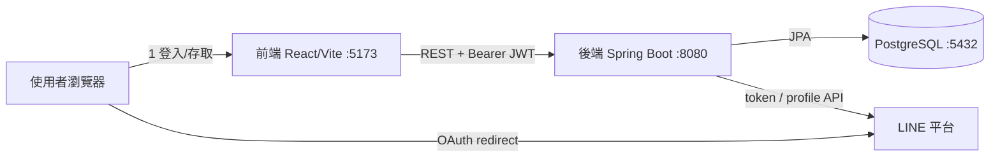

# 系統分析文件（SA）— LINE Login OAuth 2.0 POC

| 項目     | 內容                                                                                     |
| -------- | ---------------------------------------------------------------------------------------- |
| 文件版本 | v0.3（草稿，改以 id_token 取代 /v2/profile 呼叫）                                        |
| 撰寫日期 | 2026-06-29（v0.3 更新：2026-09-13）                                                       |
| 專案性質 | 概念驗證（POC）— 驗證「LINE 登入 → 後端簽發自家 JWT → 前端存取受保護資源」的最小可行流程 |
| 撰寫者   | （待補）                                                                                 |

---

## 1. 目的與範圍

### 1.1 目的

驗證以 **LINE Login（OAuth 2.0 / OIDC）** 作為第三方身分提供者，讓使用者免註冊即可登入本系統；登入後由後端簽發**自家 JWT**，前端持 JWT 存取受保護 API。

### 1.2 範圍（In Scope）

- LINE OAuth 2.0 Authorization Code 流程
- `state` + HttpOnly Cookie 的 CSRF 防護
- 後端以 Channel secret 換 `access_token` 與 `id_token`（OIDC），並驗章解析 `id_token` 取得使用者資料
- 依 `lineId` upsert 使用者
- **登入時引導加入 LINE 官方帳號**（`bot_prompt` + Friendship Status API 查詢 `friendFlag`）
- 簽發 / 驗證自家 JWT，保護 `/api/me`
- 前端登入頁、回呼頁、商品頁與 401 自動登出
- 商品頁對未加入官方帳號者顯示「加入官方帳號」提示

### 1.3 不在範圍（Out of Scope，POC 限制）

- Refresh token / token 續期機制
- 角色權限（RBAC）、多租戶
- 正式環境的密鑰管理（KMS / Secret Manager）
- 登出、帳號解綁、稽核日誌

---

## 2. 技術棧

| 層         | 技術                                                             |
| ---------- | ---------------------------------------------------------------- |
| 前端       | React 18 + TypeScript + Vite + Tailwind + TanStack Query + axios |
| 後端       | Java 21 + Spring Boot 3.x + Spring Security 6 + Spring Data JPA  |
| 資料庫     | PostgreSQL 16                                                    |
| 身分提供者 | LINE Login（`access.line.me` / `api.line.me`）                   |
| 部署       | Docker Compose（postgres / backend / frontend 三服務）           |

---

## 3. 系統架構

### 3.1 後端模組

| 套件     | 元件                                      | 職責                                      |
| -------- | ----------------------------------------- | ----------------------------------------- |
| `auth`   | `AuthController`                          | `/authorize`、`/callback`、`/me` 端點     |
| `auth`   | `LineOAuthClient`                         | 呼叫 LINE token / friendship API，並以 HS256 驗證解析 `id_token` |
| `auth`   | `JwtService`                              | 簽發 / 解析 HS256 JWT                     |
| `auth`   | `JwtAuthFilter`                           | 每請求驗 Bearer JWT，注入 SecurityContext |
| `config` | `SecurityConfig`                          | Spring Security 過濾鏈、CORS、401 策略    |
| `config` | `LineProperties` / `AppProperties`        | 設定綁定（channel、endpoint、JWT）        |
| `user`   | `User` / `UserService` / `UserRepository` | 使用者 upsert 與查詢                      |

---

## 4. 流程設計（對應 line-oauth-flow 時序圖）

### 階段一　發起登入

1. 使用者於 `/login` 點「使用 LINE 登入」。
2. 前端 `GET /api/auth/line/authorize`。
3. 後端產生 32 byte 隨機 `state`（`SecureRandom`，CSRF 防護）。
4. 後端寫入 **HttpOnly Cookie** `line_oauth_state`（Path 限 `/api/auth/line`、10 分鐘、SameSite=Lax），並 `302` 導向 LINE authorize。

### 階段二　LINE 端授權（含加入官方帳號）

5. 瀏覽器帶 `client_id / redirect_uri / state / scope=profile openid` 及 **`bot_prompt=aggressive`** 到 LINE。
6. LINE 顯示登入與同意畫面，並提供「加入官方帳號」選項（需 Login channel 已綁定 Linked OA，見 4.1）。
7. 使用者完成登入、同意，並選擇是否加入官方帳號。
8. LINE `302` 導回 `/api/auth/line/callback?code&state&friendship_status_changed`。

### 階段三　後端換 token 與簽發 JWT

9. 瀏覽器將 `code`、`state`、`friendship_status_changed` 交給後端 callback。
10. 後端比對 Cookie `state` 與 query `state`，不符回前端錯誤頁（`invalid_state`）；同時清除 state cookie。
11. 後端 `POST` LINE token endpoint，以 `code` + **`client_secret`（= Channel secret）** 換 `access_token` 與 `id_token`（因 `scope` 含 `openid`）。
12. LINE 回傳 `access_token` 與 `id_token`。
13. 後端以 `channel_secret` 為 HMAC 金鑰驗 `id_token` HS256 簽章，並檢查 `iss=https://access.line.me`、`aud=channel_id`，取出 `sub`（= `lineId`）、`name`（= `lineDisplayName`）、`picture`（= `linePictureUrl`），省去一次 `/v2/profile` 呼叫。
14. 後端 `GET` friendship status（`Bearer access_token`），取得 `friendFlag`（是否已加入官方帳號）。`friendship_status_changed` 僅代表本次是否有變動，當下狀態一律以此 API 為準。
15. `UserService.upsertFromLineProfile()` 依 `lineId` 新建或更新，並寫入 `oaFriendFlag`。
16. DB 回傳 `User`。
17. `JwtService.issue()` 簽發自家 JWT（`sub=userId`，含 `lineId`、`lineDisplayName`）。
18. 後端 `302` 導向前端 `/auth/callback?token=JWT`。

### 階段四　前端保存與存取受保護資源

19. 前端進入 `/auth/callback`。
20. 取出 token 存入 `localStorage`，導向 `/products`。
21. 前端 `GET /api/me`，axios 攔截器自動附 `Authorization: Bearer JWT`。
22. `JwtAuthFilter` 驗章、取 `sub`。
23. 依 `sub` 查 `User`，放入 SecurityContext。
24. DB 回傳 `User`。
25. 後端回 `200` + 使用者資料（含 `oaFriendFlag`、`oaAddFriendUrl`）。
26. 前端顯示商品頁；若 `oaFriendFlag=false`，於商品列表上方顯示「加入官方帳號」提示按鈕（連向 `oaAddFriendUrl`）。

### 4.1　前置設定：綁定 Linked LINE Official Account

`bot_prompt` 只有在 **LINE Login channel 綁定了官方帳號** 時才生效，否則參數會被忽略、加好友選項不會出現。設定重點：

- Login channel 與目標官方帳號（Messaging API channel）須在**同一個 Provider** 下。
- 於 LINE Login channel 設定頁的「Linked LINE Official Account」選定該官方帳號（本 POC 為 `@901yglmb`）。
- `bot_prompt=aggressive`：同意後另跳一張加好友頁（較明確）；`normal`：於同意畫面內附加好友選項。
- **補救機制**：`bot_prompt` 對「已授權過或已是好友」的使用者不會再跳，故前端另以 `friendFlag` 為準顯示 `oaAddFriendUrl` 手動加入按鈕。

### 失敗情境

JWT 無效或過期 → 後端回 **401**（`HttpStatusEntryPoint`）→ 前端 axios 攔截器清除 token 並導回 `/login`。

---

## 5. API 規格

| Method | Path                       | 認證       | 說明                       | 回應                                                      |
| ------ | -------------------------- | ---------- | -------------------------- | --------------------------------------------------------- |
| GET    | `/api/auth/line/authorize` | 否         | 產生 state、302 轉址 LINE  | `302` → LINE                                              |
| GET    | `/api/auth/line/callback`  | 否         | 驗 state、換 token、解析 id_token、查好友狀態、簽 JWT | `302` → 前端（成功帶 `token`，失敗帶 `error`）            |
| GET    | `/api/me`                  | Bearer JWT | 取登入者資料               | `200` `{id, lineId, lineDisplayName, linePictureUrl, oaFriendFlag, oaAddFriendUrl}` / `401` |
| GET    | `/actuator/health`         | 否         | 健康檢查                   | `200`                                                     |

---

## 6. 資料模型

`users` 表（JPA `ddl-auto: update` 自動建立）：

| 欄位           | 型別      | 約束                              |
| -------------- | --------- | --------------------------------- |
| `id`           | BIGINT    | PK, identity                      |
| `line_id`      | VARCHAR   | NOT NULL, **UNIQUE**（upsert 鍵） |
| `line_display_name` | VARCHAR | NOT NULL                        |
| `line_picture_url`  | VARCHAR | nullable                        |
| `oa_friend_flag` | BOOLEAN | NOT NULL, 預設 false（是否已加入官方帳號） |
| `created_at`   | TIMESTAMP | NOT NULL, 不可更新                |
| `updated_at`   | TIMESTAMP | NOT NULL                          |

---

## 7. 安全設計

| 機制                  | 實作                                                  | 對應威脅          |
| --------------------- | ----------------------------------------------------- | ----------------- |
| CSRF（OAuth state）   | 隨機 `state` 存 HttpOnly Cookie，callback 比對        | 授權碼注入 / CSRF |
| Channel secret 不外洩 | 換 token 全在後端（步驟 11），前端與網址不出現 secret | 憑證外洩          |
| id_token 驗章          | HS256 以 `channel_secret` 為金鑰驗簽，並檢查 `iss` / `aud` | id_token 偽造     |
| 無狀態認證            | `SessionCreationPolicy.STATELESS` + JWT               | Session 固定      |
| 401（非 403）         | `HttpStatusEntryPoint(UNAUTHORIZED)`                  | 配合前端自動登出  |
| CORS 白名單           | 僅允許 `FRONTEND_URL`，`allowCredentials=true`        | 跨站濫用          |
| JWT 簽章              | HS256，密鑰來自 `JWT_SECRET`                          | 偽造 token        |

### 已知風險 / POC 取捨

- **JWT 經 URL query 傳遞**（步驟 17）：可能殘留於瀏覽器歷史 / Referer / log。正式環境建議改用一次性 code 換 token，或後端 set HttpOnly Cookie。
- **JWT 存 localStorage**：易受 XSS 竊取；正式環境可評估 HttpOnly Cookie + CSRF token。
- **id_token 未檢查 `exp` / `nonce`**：目前僅驗 HS256 簽章與 `iss` / `aud`；因為 id_token 是同一次 token 交換即用即丟，`exp` 溢位風險小，但正式環境仍建議一併檢查（jjwt 預設會檢 `exp`）。
- **無 refresh / 撤銷機制**：JWT 一經簽發在到期前無法撤銷。
- **密鑰以 `.env` 明文管理**：僅限 POC，正式環境須用 Secret Manager。

---

## 8. 設定項（環境變數）

| 變數                  | 用途                                           |
| --------------------- | ---------------------------------------------- |
| `LINE_CHANNEL_ID`     | OAuth `client_id`                              |
| `LINE_CHANNEL_SECRET` | OAuth `client_secret`（換 token 用，**機密**） |
| `LINE_REDIRECT_URI`   | Callback URL（須與 LINE Console 一致）         |
| `FRONTEND_URL`        | CORS 白名單 + 回呼導向目標                     |
| `JWT_SECRET`          | 自家 JWT 簽章密鑰（`openssl rand -base64 48`） |
| `JWT_EXPIRY_MINUTES`  | JWT 有效期（預設 60）                          |
| `LINE_BOT_PROMPT`     | 加入官方帳號提示模式（`aggressive` / `normal`，預設 `aggressive`） |
| `LINE_OA_ADD_FRIEND_URL` | 官方帳號加好友連結（預設 `https://line.me/R/ti/p/@901yglmb`） |
| `POSTGRES_*`          | 資料庫連線                                     |

LINE 端點（固定）：`authorize` `https://access.line.me/oauth2/v2.1/authorize`、`token` `https://api.line.me/oauth2/v2.1/token`、`friendship` `https://api.line.me/friendship/v1/status`。

---

## 9. 後續方向（給團隊討論）

1. 改善 JWT 傳遞與儲存（一次性 code / HttpOnly Cookie）。
2. 加入 refresh token 與登出 / token 撤銷。
3. 密鑰移至 Secret Manager；DB schema 改用 Flyway 管理，停用 `ddl-auto: update`。
4. 補單元 / 整合測試（state 不符、id_token 驗章失敗、JWT 過期等）。

---

_本文件依現行程式碼撰寫，標記「（待補）」處請報告者補充。_
